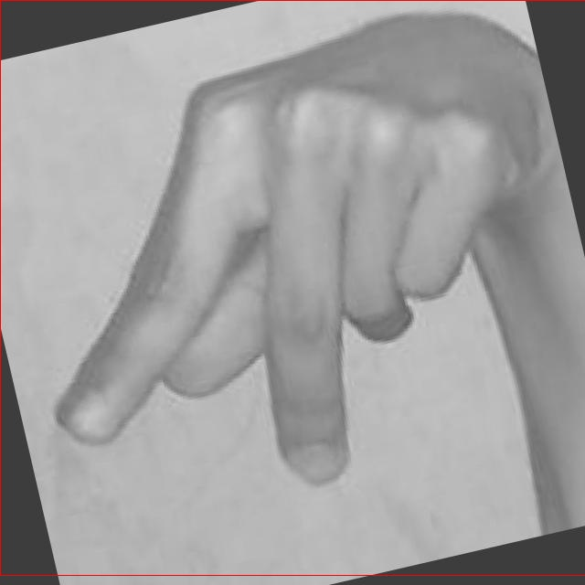

# 手语识别检测系统源码分享
 # [一条龙教学YOLOV8标注好的数据集一键训练_70+全套改进创新点发刊_Web前端展示]

### 1.研究背景与意义

项目参考[AAAI Association for the Advancement of Artificial Intelligence](https://gitee.com/qunmasj/projects)

项目来源[AACV Association for the Advancement of Computer Vision](https://kdocs.cn/l/cszuIiCKVNis)

研究背景与意义

随着信息技术的迅猛发展，手语作为一种重要的非语言交流方式，逐渐受到学术界和社会的广泛关注。手语不仅是聋哑人士沟通的主要手段，也是促进社会包容性和多样性的重要工具。全球范围内，手语的使用者数量庞大，尤其在一些国家和地区，手语已成为官方语言之一。然而，由于手语的复杂性和多样性，传统的手语学习和交流方式面临着诸多挑战。因此，开发高效、准确的手语识别系统，成为了促进手语传播和提高聋哑人士生活质量的重要研究方向。

在这一背景下，基于改进YOLOv8的手语识别系统应运而生。YOLO（You Only Look Once）系列模型因其高效的实时目标检测能力而广受欢迎，尤其是在计算机视觉领域。YOLOv8作为该系列的最新版本，具备更强的特征提取能力和更快的处理速度，适合用于复杂场景下的手语识别任务。通过对YOLOv8进行改进，结合手语的特点，可以显著提升手语识别的准确性和实时性，为聋哑人士提供更为便捷的交流工具。

本研究所使用的数据集包含4900张手语图像，涵盖24个手语类别，涵盖了从字母A到Y的手势。这一数据集的构建，不仅为手语识别系统的训练提供了丰富的样本，也为模型的评估和优化奠定了基础。数据集的多样性和代表性，能够有效提高模型的泛化能力，使其在实际应用中表现更加优异。此外，手语的多样性和复杂性使得模型在识别过程中需要具备较强的鲁棒性，而YOLOv8的改进能够在一定程度上克服这一挑战。

手语识别系统的研究不仅具有重要的学术价值，还有着深远的社会意义。通过将先进的计算机视觉技术应用于手语识别，可以有效促进聋哑人士与社会的沟通，减少他们在日常生活中的障碍，提高他们的生活质量。同时，该系统的推广应用，有助于提高公众对手语的认知和理解，促进社会对聋哑人士的接纳与支持，推动社会的和谐发展。

综上所述，基于改进YOLOv8的手语识别系统的研究，不仅为手语识别技术的发展提供了新的思路和方法，也为实现更为包容的社会环境贡献了力量。通过深入探索手语识别的技术路径，期望能够为聋哑人士创造更为友好的交流环境，助力他们更好地融入社会，实现自我价值。

### 2.图片演示


##### 注意：由于此博客编辑较早，上面“2.图片演示”和“3.视频演示”展示的系统图片或者视频可能为老版本，新版本在老版本的基础上升级如下：（实际效果以升级的新版本为准）

  （1）适配了YOLOV8的“目标检测”模型和“实例分割”模型，通过加载相应的权重（.pt）文件即可自适应加载模型。

  （2）支持“图片识别”、“视频识别”、“摄像头实时识别”三种识别模式。

  （3）支持“图片识别”、“视频识别”、“摄像头实时识别”三种识别结果保存导出，解决手动导出（容易卡顿出现爆内存）存在的问题，识别完自动保存结果并导出到tempDir中。

  （4）支持Web前端系统中的标题、背景图等自定义修改，后面提供修改教程。

  另外本项目提供训练的数据集和训练教程,暂不提供权重文件（best.pt）,需要您按照教程进行训练后实现图片演示和Web前端界面演示的效果。

### 3.视频演示

[3.1 视频演示](https://www.bilibili.com/video/BV1uCsaecE9k/)

### 4.数据集信息展示

##### 4.1 本项目数据集详细数据（类别数＆类别名）

nc: 24
names: ['A', 'B', 'C', 'D', 'E', 'F', 'G', 'H', 'I', 'K', 'L', 'M', 'N', 'O', 'P', 'Q', 'R', 'S', 'T', 'U', 'V', 'W', 'X', 'Y']


##### 4.2 本项目数据集信息介绍

数据集信息展示

在手语识别系统的研究与开发中，数据集的选择和构建至关重要。本项目所使用的数据集名为“Sign Language Recognition”，它专门设计用于训练和改进YOLOv8模型，以实现高效的手语识别功能。该数据集包含24个类别，涵盖了手语字母表中的大部分字母，具体类别包括：A、B、C、D、E、F、G、H、I、K、L、M、N、O、P、Q、R、S、T、U、V、W、X、Y。这些类别不仅代表了手语字母的基本构成，同时也为手语的识别提供了丰富的语义信息。

在构建“Sign Language Recognition”数据集时，特别注重了数据的多样性和代表性。每个字母类别均包含了大量的样本，确保模型在训练过程中能够学习到不同个体、不同环境和不同手势速度下的手语表达。这种多样性使得模型在实际应用中能够更好地适应各种手语使用者的习惯，从而提高识别的准确性和鲁棒性。

数据集中的每个类别均经过精心标注，确保每个手势的图像数据都与相应的字母类别一一对应。标注过程不仅考虑了手势的静态表现，还包括了动态手势的捕捉，提供了更为全面的训练数据。这种精细化的标注方式为YOLOv8模型的训练提供了坚实的基础，使其能够有效地学习到手势的特征，并在实际应用中实现快速、准确的识别。

此外，数据集还包含了多种拍摄角度和光照条件下的手势图像，进一步增强了模型的泛化能力。在手语识别的实际应用场景中，使用者的手势可能会受到环境因素的影响，因此，数据集的多样性和复杂性为模型的训练提供了良好的适应性。通过在不同条件下的训练，YOLOv8模型能够更好地应对现实世界中可能遇到的各种挑战。

为了确保数据集的可用性和易用性，所有图像均以标准化的格式存储，并附带详细的元数据，包括每个图像的类别标签、拍摄条件、图像尺寸等信息。这种结构化的数据存储方式不仅方便了模型的训练过程，也为后续的模型评估和性能分析提供了便利。

总之，“Sign Language Recognition”数据集以其丰富的类别、精细的标注和多样的样本，为手语识别系统的研究提供了重要的支持。通过对该数据集的有效利用，改进YOLOv8模型的手语识别能力将会大大提升，为手语交流的便利性和普及性做出积极贡献。




### 5.全套项目环境部署视频教程（零基础手把手教学）

[5.1 环境部署教程链接（零基础手把手教学）](https://www.ixigua.com/7404473917358506534?logTag=c807d0cbc21c0ef59de5)


[5.2 安装Python虚拟环境创建和依赖库安装视频教程链接（零基础手把手教学）](https://www.ixigua.com/7404474678003106304?logTag=1f1041108cd1f708b01a)

### 6.手把手YOLOV8训练视频教程（零基础小白有手就能学会）

[6.1 手把手YOLOV8训练视频教程（零基础小白有手就能学会）](https://www.ixigua.com/7404477157818401292?logTag=d31a2dfd1983c9668658)

### 7.70+种全套YOLOV8创新点代码加载调参视频教程（一键加载写好的改进模型的配置文件）

[7.1 70+种全套YOLOV8创新点代码加载调参视频教程（一键加载写好的改进模型的配置文件）](https://www.ixigua.com/7404478314661806627?logTag=29066f8288e3f4eea3a4)

### 8.70+种全套YOLOV8创新点原理讲解（非科班也可以轻松写刊发刊，V10版本正在科研待更新）

由于篇幅限制，每个创新点的具体原理讲解就不一一展开，具体见下列网址中的创新点对应子项目的技术原理博客网址【Blog】：


[8.1 70+种全套YOLOV8创新点原理讲解链接](https://gitee.com/qunmasj/good)

### 9.系统功能展示（检测对象为举例，实际内容以本项目数据集为准）

图9.1.系统支持检测结果表格显示

  图9.2.系统支持置信度和IOU阈值手动调节

  图9.3.系统支持自定义加载权重文件best.pt(需要你通过步骤5中训练获得)

  图9.4.系统支持摄像头实时识别

  图9.5.系统支持图片识别

  图9.6.系统支持视频识别

  图9.7.系统支持识别结果文件自动保存

  图9.8.系统支持Excel导出检测结果数据


### 10.原始YOLOV8算法原理

原始YOLOv8算法原理

YOLOv8算法是由Ultralytics团队在YOLOv5的基础上发展而来的，旨在进一步提升目标检测的性能和效率。自2023年1月发布以来，YOLOv8吸收了过去两年半中众多经过实际验证的改进措施，成为了一个在精度和速度上都表现优异的目标检测模型。YOLOv8模型的设计不仅关注于准确性，还兼顾了实时性，特别适合需要快速响应的应用场景。

YOLOv8模型的结构主要分为三个部分：Backbone、Neck和Head。Backbone部分负责特征提取，采用了一系列卷积和反卷积层，结合残差连接和瓶颈结构，以减小网络的大小并提高性能。在这一部分，YOLOv8引入了C2f模块，取代了之前的C3模块。C2f模块的设计灵感来源于YOLOv7中的ELAN（Efficient Layer Aggregation Network），通过增加跳层连接，增强了梯度流的信息传递，使得模型在训练过程中能够更好地捕捉到丰富的特征信息。此外，YOLOv8依然保留了快速空间金字塔池化（SPPF）模块，这一模块在保持效果的同时，显著减少了执行时间。

在Neck部分，YOLOv8通过多尺度特征融合技术，将来自Backbone不同阶段的特征图进行整合。这种融合方式使得模型能够更好地捕捉到不同尺度目标的信息，从而提高了目标检测的性能和鲁棒性。Neck部分的设计充分考虑了目标检测任务中不同尺寸目标的特点，确保模型在处理各种复杂场景时都能保持较高的准确性。

Head部分是YOLOv8的核心，负责最终的目标检测和分类任务。与之前的YOLO系列模型不同，YOLOv8采用了解耦头的设计思路，设置了两条并行的分支，分别用于提取类别和位置特征。这种设计使得分类任务和定位任务可以更专注于各自的目标，分类任务侧重于分析特征图中提取到的特征与已有类别的相似性，而定位任务则关注边界框与真实框之间的位置关系。通过这种方式，YOLOv8在收敛速度和预测精度上都有了显著提升。

YOLOv8还引入了无锚框结构，直接预测目标的中心位置，并使用任务对齐学习（Task Alignment Learning, TAL）来区分正负样本。该方法通过引入分类分数和IOU（Intersection over Union）的高次幂乘积作为衡量任务对齐程度的指标，进一步提升了模型在分类和定位任务中的表现。这种创新的设计理念，使得YOLOv8在同时兼顾定位和分类精度方面表现得更加出色。

在数据增强方面，YOLOv8对Mosaic数据增强的使用进行了调整。尽管Mosaic数据增强在提升模型鲁棒性和泛化性方面具有一定的优势，但Ultralytics团队发现其在一定程度上可能会破坏数据的真实分布，导致模型学习到一些不良信息。因此，YOLOv8在训练的最后10个epoch中停止使用Mosaic数据增强，以确保模型能够更好地适应真实场景。

在性能方面，YOLOv8在COCO数据集上的表现令人瞩目。通过对比不同尺寸的模型，YOLOv8在保持参数量不变的情况下，取得了比其他模型更高的精度。此外，YOLOv8在推理速度上也优于其他YOLO系列模型，展示了其在实时目标检测任务中的潜力。

综上所述，YOLOv8算法通过对网络结构的优化、数据增强策略的调整以及任务对齐学习的引入，极大地提升了目标检测的性能。其设计不仅关注模型的准确性，还兼顾了实时性，适用于各种复杂的应用场景，尤其是在需要快速响应的任务中表现尤为突出。随着YOLOv8的不断发展和应用，未来在目标检测领域将有更多的研究和实践机会，推动这一技术的进一步进步。


### 11.项目核心源码讲解（再也不用担心看不懂代码逻辑）

#### 11.1 ui.py

以下是经过简化和注释的核心代码部分：

```python
import sys
import subprocess
from QtFusion.path import abs_path

def run_script(script_path):
    """
    使用当前 Python 环境运行指定的脚本。

    Args:
        script_path (str): 要运行的脚本路径
    """
    # 获取当前 Python 解释器的路径
    python_path = sys.executable

    # 构建运行命令，使用 streamlit 运行指定的脚本
    command = f'"{python_path}" -m streamlit run "{script_path}"'

    # 执行命令并获取结果
    result = subprocess.run(command, shell=True)
    
    # 检查脚本运行是否成功
    if result.returncode != 0:
        print("脚本运行出错。")

# 主程序入口
if __name__ == "__main__":
    # 获取要运行的脚本的绝对路径
    script_path = abs_path("web.py")

    # 调用函数运行脚本
    run_script(script_path)
```

### 代码注释说明：

1. **导入模块**：
   - `sys`：用于访问与 Python 解释器相关的变量和函数。
   - `subprocess`：用于创建新进程、连接到它们的输入/输出/错误管道，并获取返回码。
   - `abs_path`：从 `QtFusion.path` 模块导入的函数，用于获取文件的绝对路径。

2. **`run_script` 函数**：
   - 该函数接收一个脚本路径作为参数，并使用当前 Python 环境运行该脚本。
   - 使用 `sys.executable` 获取当前 Python 解释器的路径。
   - 构建一个命令字符串，使用 `streamlit` 运行指定的脚本。
   - 使用 `subprocess.run` 执行构建的命令，并检查返回码以判断脚本是否成功运行。

3. **主程序入口**：
   - 使用 `if __name__ == "__main__":` 确保该代码块仅在直接运行该脚本时执行。
   - 获取要运行的脚本的绝对路径，并调用 `run_script` 函数来执行该脚本。

这个文件名为 `ui.py`，它的主要功能是运行一个指定的 Python 脚本，具体来说是通过 Streamlit 框架来启动一个 Web 应用。文件中首先导入了必要的模块，包括 `sys`、`os` 和 `subprocess`，这些模块分别用于处理系统相关的操作、文件路径操作和执行外部命令。

在 `run_script` 函数中，首先定义了一个参数 `script_path`，它代表要运行的脚本的路径。函数内部首先获取当前 Python 解释器的路径，这通过 `sys.executable` 实现。接着，构建了一个命令字符串，该命令用于在命令行中运行 Streamlit，具体命令为 `"{python_path}" -m streamlit run "{script_path}"`，其中 `python_path` 是当前 Python 解释器的路径，`script_path` 是要运行的脚本路径。

然后，使用 `subprocess.run` 方法执行这个命令。这个方法会在一个新的进程中运行命令，并等待其完成。如果命令执行后返回的状态码不为 0，表示脚本运行出错，程序会打印出“脚本运行出错。”的提示信息。

在文件的最后部分，使用 `if __name__ == "__main__":` 这一结构来确保当该文件作为主程序运行时，下面的代码才会被执行。在这里，首先调用 `abs_path` 函数来获取 `web.py` 脚本的绝对路径，然后调用 `run_script` 函数来运行这个脚本。

总体来说，这个程序的功能是通过 Streamlit 框架来启动一个 Web 应用，提供了一种简单的方式来运行指定的 Python 脚本。

#### 11.2 code\ultralytics\data\loaders.py

以下是代码中最核心的部分，并附上详细的中文注释：

```python
import cv2
import numpy as np
import torch
from threading import Thread
from pathlib import Path

class LoadStreams:
    """
    用于加载各种类型的视频流。

    支持 RTSP、RTMP、HTTP 和 TCP 流，适用于 `yolo predict source='rtsp://example.com/media.mp4'`。

    属性:
        sources (str): 视频流的输入路径或 URL。
        imgsz (int): 处理的图像大小，默认为 640。
        vid_stride (int): 视频帧率步幅，默认为 1。
        buffer (bool): 是否缓冲输入流，默认为 False。
        running (bool): 标志，指示流线程是否正在运行。
        imgs (list): 每个流的图像帧列表。
        fps (list): 每个流的帧率列表。
        frames (list): 每个流的总帧数列表。
        threads (list): 每个流的线程列表。
        shape (list): 每个流的形状列表。
        caps (list): 每个流的 cv2.VideoCapture 对象列表。
        bs (int): 处理的批量大小。

    方法:
        __init__: 初始化流加载器。
        update: 在守护线程中读取流帧。
        close: 关闭流加载器并释放资源。
        __iter__: 返回类的迭代器对象。
        __next__: 返回源路径、转换后的图像和原始图像以供处理。
        __len__: 返回源对象的长度。
    """

    def __init__(self, sources="file.streams", imgsz=640, vid_stride=1, buffer=False):
        """初始化实例变量并检查输入流形状的一致性。"""
        torch.backends.cudnn.benchmark = True  # 对于固定大小的推理更快
        self.buffer = buffer  # 缓冲输入流
        self.running = True  # 线程运行标志
        self.imgsz = imgsz  # 图像大小
        self.vid_stride = vid_stride  # 视频帧率步幅

        # 读取源路径
        sources = Path(sources).read_text().rsplit() if os.path.isfile(sources) else [sources]
        n = len(sources)
        self.fps = [0] * n  # 每秒帧数
        self.frames = [0] * n
        self.threads = [None] * n
        self.caps = [None] * n  # 视频捕获对象
        self.imgs = [[] for _ in range(n)]  # 图像
        self.shape = [[] for _ in range(n)]  # 图像形状
        self.sources = [x.strip() for x in sources]  # 清理源名称

        for i, s in enumerate(sources):  # 遍历源
            self.caps[i] = cv2.VideoCapture(s)  # 存储视频捕获对象
            if not self.caps[i].isOpened():
                raise ConnectionError(f"无法打开 {s}")
            w = int(self.caps[i].get(cv2.CAP_PROP_FRAME_WIDTH))
            h = int(self.caps[i].get(cv2.CAP_PROP_FRAME_HEIGHT))
            fps = self.caps[i].get(cv2.CAP_PROP_FPS)  # 帧率
            self.frames[i] = max(int(self.caps[i].get(cv2.CAP_PROP_FRAME_COUNT)), 0) or float("inf")  # 无限流回退
            self.fps[i] = max((fps if fps > 0 else 30), 0)  # 帧率回退为 30

            success, im = self.caps[i].read()  # 确保读取第一帧
            if not success or im is None:
                raise ConnectionError(f"无法从 {s} 读取图像")
            self.imgs[i].append(im)
            self.shape[i] = im.shape
            self.threads[i] = Thread(target=self.update, args=([i, self.caps[i], s]), daemon=True)  # 启动线程读取帧
            self.threads[i].start()

    def update(self, i, cap, stream):
        """在守护线程中读取流 `i` 的帧。"""
        n = 0  # 帧计数
        while self.running and cap.isOpened():
            if len(self.imgs[i]) < 30:  # 保持 <=30 图像缓冲
                n += 1
                cap.grab()  # 抓取帧
                if n % self.vid_stride == 0:
                    success, im = cap.retrieve()  # 获取帧
                    if not success:
                        im = np.zeros(self.shape[i], dtype=np.uint8)  # 创建空图像
                    if self.buffer:
                        self.imgs[i].append(im)  # 如果缓冲，添加图像
                    else:
                        self.imgs[i] = [im]  # 否则只保留最新图像
            else:
                time.sleep(0.01)  # 等待缓冲区清空

    def close(self):
        """关闭流加载器并释放资源。"""
        self.running = False  # 停止线程
        for thread in self.threads:
            if thread.is_alive():
                thread.join(timeout=5)  # 等待线程结束
        for cap in self.caps:  # 释放视频捕获对象
            cap.release()
        cv2.destroyAllWindows()  # 关闭所有 OpenCV 窗口

    def __iter__(self):
        """返回 YOLO 图像流的迭代器。"""
        self.count = -1
        return self

    def __next__(self):
        """返回源路径、转换后的图像和原始图像以供处理。"""
        self.count += 1
        images = []
        for i, x in enumerate(self.imgs):
            while not x:  # 等待每个缓冲区中的帧
                if not self.threads[i].is_alive():
                    self.close()
                    raise StopIteration
                time.sleep(1 / max(self.fps))  # 等待
                x = self.imgs[i]

            images.append(x.pop(0))  # 获取并移除缓冲区中的第一帧

        return self.sources, images, None, ""

    def __len__(self):
        """返回源对象的长度。"""
        return len(self.sources)  # 返回源数量
```

### 代码说明：
1. **LoadStreams 类**：用于加载视频流，支持多种流格式（如 RTSP、RTMP、HTTP、TCP）。
2. **__init__ 方法**：初始化类的属性，读取视频源，创建视频捕获对象，并启动线程读取视频帧。
3. **update 方法**：在后台线程中不断读取视频帧，并将其存储在缓冲区中。
4. **close 方法**：关闭所有打开的流和释放资源。
5. **__iter__ 和 __next__ 方法**：实现迭代器协议，使得可以逐帧获取视频流中的图像。

这个核心部分展示了如何使用 OpenCV 读取视频流并在后台处理帧，为后续的图像处理或目标检测提供数据。

这个程序文件 `loaders.py` 是 Ultralytics YOLO 框架的一部分，主要用于加载和处理不同类型的输入数据，包括视频流、图像、屏幕截图和张量数据。文件中定义了多个类，每个类负责不同的数据加载方式。

首先，文件导入了一些必要的库，包括用于图像处理的 OpenCV、NumPy、PIL 以及用于处理多线程的 `threading` 模块等。接着，定义了一个数据类 `SourceTypes`，用于表示不同的输入源类型，如网络摄像头、截图、图像文件和张量。

`LoadStreams` 类用于处理视频流，支持 RTSP、RTMP、HTTP 和 TCP 等协议。该类在初始化时会读取输入源，并为每个源创建一个视频捕获对象。它还启动一个线程来持续读取视频帧，并提供迭代器接口以便于逐帧处理。在读取过程中，类会检查视频流的状态，确保能够成功获取帧数据。

`LoadScreenshots` 类则专注于从屏幕捕获图像。它使用 `mss` 库来实现屏幕截图功能，并允许用户指定捕获区域。该类同样实现了迭代器接口，以便于逐帧获取截图。

`LoadImages` 类负责加载图像和视频文件。它支持从文件路径、目录或文本文件中读取图像和视频，并提供迭代器接口来逐个返回图像或视频帧。该类还包含一个私有方法 `_new_video`，用于创建新的视频捕获对象。

`LoadPilAndNumpy` 类用于处理来自 PIL 和 NumPy 数组的图像数据。它确保输入图像的格式正确，并提供迭代器接口以便于批量处理图像。

`LoadTensor` 类则专注于从 PyTorch 张量中加载图像数据。它验证输入张量的形状，并确保其符合要求。

最后，文件还定义了一个 `autocast_list` 函数，用于将不同类型的输入源合并为 NumPy 数组或 PIL 图像的列表。此外，`get_best_youtube_url` 函数用于从给定的 YouTube 视频 URL 中提取最佳质量的 MP4 视频流 URL。

整体来看，这个文件提供了灵活的数据加载机制，能够处理多种类型的输入数据，方便后续的图像处理和模型推理。

#### 11.3 code\ultralytics\data\split_dota.py

以下是经过简化并添加详细中文注释的核心代码部分：

```python
import itertools
from glob import glob
from math import ceil
from pathlib import Path
import cv2
import numpy as np
from PIL import Image
from tqdm import tqdm
from ultralytics.data.utils import exif_size, img2label_paths

def load_yolo_dota(data_root, split="train"):
    """
    加载DOTA数据集。

    参数:
        data_root (str): 数据根目录。
        split (str): 数据集的划分，可以是'train'或'val'。

    返回:
        annos (list): 包含每个图像的原始尺寸、标签和文件路径的字典列表。
    """
    assert split in ["train", "val"]
    im_dir = Path(data_root) / "images" / split
    assert im_dir.exists(), f"找不到 {im_dir}，请检查数据根目录。"
    im_files = glob(str(Path(data_root) / "images" / split / "*"))
    lb_files = img2label_paths(im_files)
    annos = []
    for im_file, lb_file in zip(im_files, lb_files):
        w, h = exif_size(Image.open(im_file))  # 获取图像的原始尺寸
        with open(lb_file) as f:
            lb = [x.split() for x in f.read().strip().splitlines() if len(x)]
            lb = np.array(lb, dtype=np.float32)  # 转换标签为浮点数数组
        annos.append(dict(ori_size=(h, w), label=lb, filepath=im_file))  # 存储图像信息
    return annos

def get_windows(im_size, crop_sizes=[1024], gaps=[200], im_rate_thr=0.6, eps=0.01):
    """
    获取窗口的坐标。

    参数:
        im_size (tuple): 原始图像尺寸，(高, 宽)。
        crop_sizes (List(int)): 窗口的裁剪尺寸。
        gaps (List(int)): 窗口之间的间隔。
        im_rate_thr (float): 窗口面积与图像面积的阈值。

    返回:
        windows (np.ndarray): 窗口的坐标数组。
    """
    h, w = im_size
    windows = []
    for crop_size, gap in zip(crop_sizes, gaps):
        assert crop_size > gap, f"无效的裁剪尺寸和间隔对 [{crop_size} {gap}]"
        step = crop_size - gap

        # 计算在宽度方向上的窗口数量和位置
        xn = 1 if w <= crop_size else ceil((w - crop_size) / step + 1)
        xs = [step * i for i in range(xn)]
        if len(xs) > 1 and xs[-1] + crop_size > w:
            xs[-1] = w - crop_size

        # 计算在高度方向上的窗口数量和位置
        yn = 1 if h <= crop_size else ceil((h - crop_size) / step + 1)
        ys = [step * i for i in range(yn)]
        if len(ys) > 1 and ys[-1] + crop_size > h:
            ys[-1] = h - crop_size

        start = np.array(list(itertools.product(xs, ys)), dtype=np.int64)  # 窗口起始坐标
        stop = start + crop_size  # 窗口结束坐标
        windows.append(np.concatenate([start, stop], axis=1))  # 合并起始和结束坐标
    windows = np.concatenate(windows, axis=0)

    # 计算窗口的有效区域
    im_in_wins = windows.copy()
    im_in_wins[:, 0::2] = np.clip(im_in_wins[:, 0::2], 0, w)
    im_in_wins[:, 1::2] = np.clip(im_in_wins[:, 1::2], 0, h)
    im_areas = (im_in_wins[:, 2] - im_in_wins[:, 0]) * (im_in_wins[:, 3] - im_in_wins[:, 1])
    win_areas = (windows[:, 2] - windows[:, 0]) * (windows[:, 3] - windows[:, 1])
    im_rates = im_areas / win_areas  # 计算有效区域比率
    if not (im_rates > im_rate_thr).any():
        max_rate = im_rates.max()
        im_rates[abs(im_rates - max_rate) < eps] = 1  # 处理极小值
    return windows[im_rates > im_rate_thr]  # 返回有效窗口

def split_images_and_labels(data_root, save_dir, split="train", crop_sizes=[1024], gaps=[200]):
    """
    切分图像和标签。

    参数:
        data_root (str): 数据根目录。
        save_dir (str): 保存目录。
        split (str): 数据集的划分，可以是'train'或'val'。
        crop_sizes (List(int)): 窗口的裁剪尺寸。
        gaps (List(int)): 窗口之间的间隔。
    """
    im_dir = Path(save_dir) / "images" / split
    im_dir.mkdir(parents=True, exist_ok=True)  # 创建图像保存目录
    lb_dir = Path(save_dir) / "labels" / split
    lb_dir.mkdir(parents=True, exist_ok=True)  # 创建标签保存目录

    annos = load_yolo_dota(data_root, split=split)  # 加载数据集
    for anno in tqdm(annos, total=len(annos), desc=split):
        windows = get_windows(anno["ori_size"], crop_sizes, gaps)  # 获取窗口
        window_objs = get_window_obj(anno, windows)  # 获取每个窗口内的对象
        crop_and_save(anno, windows, window_objs, str(im_dir), str(lb_dir))  # 裁剪并保存

if __name__ == "__main__":
    split_images_and_labels(data_root="DOTAv2", save_dir="DOTAv2-split", split="train")
    split_images_and_labels(data_root="DOTAv2", save_dir="DOTAv2-split", split="val")
```

### 代码说明
1. **load_yolo_dota**: 加载DOTA数据集，读取图像和标签，返回包含图像信息的字典列表。
2. **get_windows**: 根据给定的图像尺寸、裁剪尺寸和间隔，计算出窗口的坐标。
3. **split_images_and_labels**: 切分图像和标签，将原始数据集划分为多个窗口并保存到指定目录。

这个程序文件主要用于处理DOTA（Dataset for Object Detection in Aerial Images）数据集，目的是将大图像切分成小块，并相应地生成标签文件。程序的结构清晰，包含多个函数，每个函数负责特定的任务。

首先，程序导入了一些必要的库，包括`itertools`、`glob`、`math`、`pathlib`、`cv2`、`numpy`、`PIL`、`tqdm`和`shapely`。这些库提供了文件操作、图像处理、数学计算和进度条显示等功能。

程序的核心功能是通过一系列函数实现的。`bbox_iof`函数计算两个边界框之间的交并比（IOF），用于评估窗口与目标物体之间的重叠程度。`load_yolo_dota`函数加载DOTA数据集中的图像和标签，返回一个包含原始图像大小、标签和文件路径的字典列表。

`get_windows`函数根据给定的图像大小、裁剪尺寸和间隔，生成裁剪窗口的坐标。这个函数确保生成的窗口不会超出图像边界，并计算每个窗口的面积与图像面积的比率，以筛选出符合条件的窗口。

`get_window_obj`函数根据给定的窗口和标注信息，获取每个窗口内的目标物体。它使用`bbox_iof`函数来判断哪些目标物体与窗口有足够的重叠。

`crop_and_save`函数负责根据窗口裁剪图像并保存，同时生成新的标签文件。它会将标签坐标调整为相对于窗口的坐标，并将其写入文本文件中。

`split_images_and_labels`函数是整个流程的主控函数，它加载数据集，生成窗口，获取窗口内的目标物体，然后进行裁剪和保存。`split_trainval`和`split_test`函数分别用于处理训练集、验证集和测试集，确保数据集的结构符合要求。

在程序的最后，`if __name__ == "__main__":`部分用于执行数据集的切分操作，指定数据根目录和保存目录。

总的来说，这个程序实现了对DOTA数据集的有效处理，通过切分图像和生成相应的标签，为后续的目标检测任务做好准备。

#### 11.4 70+种YOLOv8算法改进源码大全和调试加载训练教程（非必要）\ultralytics\nn\modules\utils.py

以下是经过简化和注释的核心代码部分：

```python
import torch
import torch.nn.functional as F

def inverse_sigmoid(x, eps=1e-5):
    """计算张量的反sigmoid函数。
    
    参数:
        x (torch.Tensor): 输入张量，值应在[0, 1]之间。
        eps (float): 防止除零的极小值。
        
    返回:
        torch.Tensor: 反sigmoid计算结果。
    """
    # 限制x的范围在0到1之间
    x = x.clamp(min=0, max=1)
    # 为了避免计算中的除零，限制x的最小值
    x1 = x.clamp(min=eps)
    x2 = (1 - x).clamp(min=eps)
    # 计算反sigmoid
    return torch.log(x1 / x2)

def multi_scale_deformable_attn_pytorch(value: torch.Tensor, value_spatial_shapes: torch.Tensor,
                                        sampling_locations: torch.Tensor,
                                        attention_weights: torch.Tensor) -> torch.Tensor:
    """
    多尺度可变形注意力机制。

    参数:
        value (torch.Tensor): 输入特征，形状为 (batch_size, num_channels, num_heads, embed_dims)。
        value_spatial_shapes (torch.Tensor): 特征图的空间形状。
        sampling_locations (torch.Tensor): 采样位置，形状为 (batch_size, num_queries, num_heads, num_levels, num_points, 2)。
        attention_weights (torch.Tensor): 注意力权重，形状为 (batch_size, num_heads, num_queries, num_levels, num_points)。

    返回:
        torch.Tensor: 经过注意力机制处理后的输出特征。
    """
    bs, _, num_heads, embed_dims = value.shape  # 获取输入特征的维度
    _, num_queries, _, num_levels, num_points, _ = sampling_locations.shape  # 获取采样位置的维度
    
    # 将输入特征按照空间形状分割成多个特征图
    value_list = value.split([H_ * W_ for H_, W_ in value_spatial_shapes], dim=1)
    # 将采样位置映射到[-1, 1]的范围
    sampling_grids = 2 * sampling_locations - 1
    sampling_value_list = []  # 存储每个层级的采样值

    for level, (H_, W_) in enumerate(value_spatial_shapes):
        # 对每个层级的特征图进行处理
        value_l_ = (value_list[level].flatten(2).transpose(1, 2).reshape(bs * num_heads, embed_dims, H_, W_))
        # 处理采样位置
        sampling_grid_l_ = sampling_grids[:, :, :, level].transpose(1, 2).flatten(0, 1)
        # 使用grid_sample进行双线性插值采样
        sampling_value_l_ = F.grid_sample(value_l_,
                                          sampling_grid_l_,
                                          mode='bilinear',
                                          padding_mode='zeros',
                                          align_corners=False)
        sampling_value_list.append(sampling_value_l_)  # 将采样结果添加到列表中

    # 处理注意力权重并计算最终输出
    attention_weights = attention_weights.transpose(1, 2).reshape(bs * num_heads, 1, num_queries,
                                                                  num_levels * num_points)
    output = ((torch.stack(sampling_value_list, dim=-2).flatten(-2) * attention_weights).sum(-1).view(
        bs, num_heads * embed_dims, num_queries))
    
    return output.transpose(1, 2).contiguous()  # 返回最终输出，调整维度顺序
```

### 代码说明：
1. **inverse_sigmoid** 函数用于计算输入张量的反sigmoid值，防止除零错误，通过限制输入范围和添加一个极小值 `eps` 来实现。
2. **multi_scale_deformable_attn_pytorch** 函数实现了多尺度可变形注意力机制。它通过对输入特征进行空间分割和采样，结合注意力权重，生成最终的输出特征。主要步骤包括：
   - 将输入特征分割成多个层级。
   - 将采样位置转换到[-1, 1]范围。
   - 对每个层级的特征图进行双线性插值采样。
   - 结合注意力权重计算最终输出特征。

这个程序文件是一个与YOLOv8算法相关的工具模块，主要包含了一些深度学习中常用的功能和初始化方法。文件的开头包含了版权信息，表明这是Ultralytics YOLO项目的一部分，并且遵循AGPL-3.0许可证。

首先，文件导入了一些必要的库，包括`copy`、`math`、`numpy`和`torch`等，这些库提供了深度学习和数学计算所需的功能。接着，定义了一个`__all__`变量，列出了模块中公开的函数。

接下来，定义了一个名为`_get_clones`的函数，该函数用于克隆给定的模块，并返回一个包含多个克隆模块的列表。这在构建复杂的神经网络结构时非常有用，可以确保每个模块都有独立的参数。

`bias_init_with_prob`函数用于根据给定的概率值初始化卷积或全连接层的偏置。它通过计算负对数几率来设置偏置值，以便在训练时更好地控制输出的概率分布。

`linear_init_`函数则用于初始化线性模块的权重和偏置。它使用均匀分布来初始化权重和偏置，以保证模型在训练初期的稳定性。

`inverse_sigmoid`函数计算输入张量的反sigmoid函数。该函数首先将输入限制在0到1之间，然后计算反sigmoid值，避免了数值不稳定的问题。

最后，`multi_scale_deformable_attn_pytorch`函数实现了多尺度可变形注意力机制。该函数接收多个输入，包括值张量、空间形状、采样位置和注意力权重。函数内部首先对输入进行分割和重塑，然后通过双线性插值对采样位置进行采样，最后结合注意力权重计算输出。这个过程涉及到多头注意力机制的实现，适用于处理复杂的视觉任务。

总体来说，这个模块提供了一些基础的工具和函数，帮助构建和训练YOLOv8模型，尤其是在处理注意力机制和参数初始化方面。

#### 11.5 70+种YOLOv8算法改进源码大全和调试加载训练教程（非必要）\ultralytics\engine\exporter.py

以下是代码中最核心的部分，并附上详细的中文注释：

```python
class Exporter:
    """
    导出模型的类。

    属性:
        args (SimpleNamespace): 导出器的配置。
        callbacks (list, optional): 回调函数列表。默认为 None。
    """

    def __init__(self, cfg=DEFAULT_CFG, overrides=None, _callbacks=None):
        """
        初始化 Exporter 类。

        参数:
            cfg (str, optional): 配置文件的路径。默认为 DEFAULT_CFG。
            overrides (dict, optional): 配置覆盖。默认为 None。
            _callbacks (dict, optional): 回调函数的字典。默认为 None。
        """
        self.args = get_cfg(cfg, overrides)  # 获取配置
        self.callbacks = _callbacks or callbacks.get_default_callbacks()  # 设置回调函数

    @smart_inference_mode()
    def __call__(self, model=None):
        """运行导出过程并返回导出文件/目录的列表。"""
        self.run_callbacks('on_export_start')  # 运行导出开始的回调
        fmt = self.args.format.lower()  # 将格式转换为小写
        fmts = tuple(export_formats()['Argument'][1:])  # 获取可用的导出格式
        flags = [x == fmt for x in fmts]  # 检查所需格式是否有效
        if sum(flags) != 1:
            raise ValueError(f"无效的导出格式='{fmt}'。有效格式为 {fmts}")

        # 设备选择
        self.device = select_device('cpu' if self.args.device is None else self.args.device)

        # 输入检查
        im = torch.zeros(self.args.batch, 3, *self.imgsz).to(self.device)  # 创建输入张量
        model = deepcopy(model).to(self.device)  # 深拷贝模型并移动到设备
        model.eval()  # 设置模型为评估模式

        # 运行模型以进行干运行
        y = model(im)  # 进行一次前向推理以确保模型正常工作

        # 导出过程
        f = [''] * len(fmts)  # 初始化导出文件名列表
        if 'torchscript' in fmt:  # 导出为 TorchScript
            f[0], _ = self.export_torchscript()
        if 'onnx' in fmt:  # 导出为 ONNX
            f[1], _ = self.export_onnx()

        # 完成导出
        f = [str(x) for x in f if x]  # 过滤掉空值
        self.run_callbacks('on_export_end')  # 运行导出结束的回调
        return f  # 返回导出文件/目录的列表

    @try_export
    def export_onnx(self, prefix=colorstr('ONNX:')):
        """导出为 YOLOv8 ONNX 格式。"""
        opset_version = self.args.opset or get_latest_opset()  # 获取 ONNX 的 opset 版本
        f = str(self.file.with_suffix('.onnx'))  # 设置导出文件名

        # 导出模型为 ONNX 格式
        torch.onnx.export(
            self.model.cpu(),  # 将模型移动到 CPU
            self.im.cpu(),  # 将输入移动到 CPU
            f,
            opset_version=opset_version,
            input_names=['images'],  # 输入名称
            output_names=['output0'],  # 输出名称
        )

        return f, None  # 返回导出文件名和 None
```

### 代码说明：
1. **Exporter 类**：负责导出模型的核心类，包含初始化方法和导出逻辑。
2. **__call__ 方法**：运行导出过程，选择设备，检查输入，执行模型的干运行，并根据指定格式导出模型。
3. **export_onnx 方法**：将模型导出为 ONNX 格式，设置必要的参数并调用 `torch.onnx.export` 函数执行导出。

通过这些核心部分，可以实现将 YOLOv8 模型导出为不同格式的功能。

这个程序文件是一个用于导出YOLOv8模型的Python脚本，主要功能是将训练好的YOLOv8模型转换为多种格式，以便在不同的框架和平台上使用。文件中包含了导出模型所需的各种功能和类。

首先，文件开头部分是一些注释，介绍了支持的导出格式，包括PyTorch、TorchScript、ONNX、OpenVINO、TensorRT、CoreML、TensorFlow SavedModel、TensorFlow GraphDef、TensorFlow Lite、TensorFlow Edge TPU、TensorFlow.js、PaddlePaddle和ncnn等。这些格式可以通过指定相应的参数进行导出。

接下来，文件导入了一些必要的库和模块，包括JSON处理、文件操作、时间处理、警告管理、深度学习相关的库（如PyTorch和NumPy）等。

`export_formats`函数定义了支持的导出格式，并返回一个包含格式信息的DataFrame。`gd_outputs`函数用于获取TensorFlow GraphDef模型的输出节点名称。

`try_export`是一个装饰器，用于捕获导出过程中的异常并记录成功或失败的信息。

`Exporter`类是整个导出过程的核心，包含了初始化方法和调用方法。初始化方法接受配置文件路径、覆盖的配置和回调函数等参数，并根据这些参数设置导出器的属性。调用方法则执行导出过程，包括检查输入参数、准备模型、执行导出等步骤。

在导出过程中，程序会根据指定的格式调用相应的导出函数，例如`export_torchscript`、`export_onnx`、`export_openvino`等。这些函数负责将模型转换为特定格式，并处理相关的元数据和优化。

每个导出函数中都有详细的日志记录，方便用户了解导出进度和状态。导出完成后，程序会返回导出的文件路径，并提供一些后续操作的建议，例如如何进行推理和验证。

最后，文件中还定义了一些辅助类和方法，例如`IOSDetectModel`类用于将YOLO模型包装为适合iOS CoreML导出的格式。

总的来说，这个文件提供了一个全面的解决方案，用于将YOLOv8模型导出为多种格式，以便在不同的应用场景中使用。

#### 11.6 train.py

以下是经过简化和注释的核心代码部分：

```python
import random
import numpy as np
import torch.nn as nn
from ultralytics.data import build_dataloader, build_yolo_dataset
from ultralytics.engine.trainer import BaseTrainer
from ultralytics.models import yolo
from ultralytics.nn.tasks import DetectionModel
from ultralytics.utils import LOGGER, RANK
from ultralytics.utils.torch_utils import de_parallel, torch_distributed_zero_first

class DetectionTrainer(BaseTrainer):
    """
    扩展自 BaseTrainer 类，用于基于检测模型的训练。
    """

    def build_dataset(self, img_path, mode="train", batch=None):
        """
        构建 YOLO 数据集。

        参数:
            img_path (str): 包含图像的文件夹路径。
            mode (str): 模式，可以是 'train' 或 'val'，用户可以为每种模式自定义不同的增强。
            batch (int, optional): 批次大小，适用于 'rect' 模式。默认为 None。
        """
        gs = max(int(de_parallel(self.model).stride.max() if self.model else 0), 32)
        return build_yolo_dataset(self.args, img_path, batch, self.data, mode=mode, rect=mode == "val", stride=gs)

    def get_dataloader(self, dataset_path, batch_size=16, rank=0, mode="train"):
        """构造并返回数据加载器。"""
        assert mode in ["train", "val"]
        with torch_distributed_zero_first(rank):  # 仅在 DDP 时初始化数据集 *.cache 一次
            dataset = self.build_dataset(dataset_path, mode, batch_size)
        shuffle = mode == "train"  # 训练模式下打乱数据
        workers = self.args.workers if mode == "train" else self.args.workers * 2
        return build_dataloader(dataset, batch_size, workers, shuffle, rank)  # 返回数据加载器

    def preprocess_batch(self, batch):
        """对一批图像进行预处理，包括缩放和转换为浮点数。"""
        batch["img"] = batch["img"].to(self.device, non_blocking=True).float() / 255  # 将图像归一化到 [0, 1]
        if self.args.multi_scale:  # 如果启用多尺度
            imgs = batch["img"]
            sz = (
                random.randrange(self.args.imgsz * 0.5, self.args.imgsz * 1.5 + self.stride)
                // self.stride
                * self.stride
            )  # 随机选择新的尺寸
            sf = sz / max(imgs.shape[2:])  # 计算缩放因子
            if sf != 1:
                ns = [
                    math.ceil(x * sf / self.stride) * self.stride for x in imgs.shape[2:]
                ]  # 计算新的形状
                imgs = nn.functional.interpolate(imgs, size=ns, mode="bilinear", align_corners=False)  # 调整图像大小
            batch["img"] = imgs
        return batch

    def set_model_attributes(self):
        """设置模型的属性，包括类别数量和名称。"""
        self.model.nc = self.data["nc"]  # 将类别数量附加到模型
        self.model.names = self.data["names"]  # 将类别名称附加到模型
        self.model.args = self.args  # 将超参数附加到模型

    def get_model(self, cfg=None, weights=None, verbose=True):
        """返回 YOLO 检测模型。"""
        model = DetectionModel(cfg, nc=self.data["nc"], verbose=verbose and RANK == -1)
        if weights:
            model.load(weights)  # 加载权重
        return model

    def plot_training_samples(self, batch, ni):
        """绘制带有注释的训练样本。"""
        plot_images(
            images=batch["img"],
            batch_idx=batch["batch_idx"],
            cls=batch["cls"].squeeze(-1),
            bboxes=batch["bboxes"],
            paths=batch["im_file"],
            fname=self.save_dir / f"train_batch{ni}.jpg",
            on_plot=self.on_plot,
        )
```

### 代码注释说明：
1. **类定义**：`DetectionTrainer` 类用于实现 YOLO 模型的训练，继承自 `BaseTrainer`。
2. **构建数据集**：`build_dataset` 方法用于根据输入的图像路径和模式构建 YOLO 数据集。
3. **获取数据加载器**：`get_dataloader` 方法构造并返回数据加载器，支持分布式训练。
4. **预处理批次**：`preprocess_batch` 方法对输入的图像批次进行归一化和缩放处理。
5. **设置模型属性**：`set_model_attributes` 方法将数据集的类别信息和超参数设置到模型中。
6. **获取模型**：`get_model` 方法返回一个 YOLO 检测模型，并可选择加载预训练权重。
7. **绘制训练样本**：`plot_training_samples` 方法用于绘制训练样本及其注释，便于可视化训练过程。

这个程序文件 `train.py` 是一个用于训练 YOLO（You Only Look Once）目标检测模型的实现，继承自 `BaseTrainer` 类。程序中主要定义了一个 `DetectionTrainer` 类，该类包含了一系列方法，用于构建数据集、获取数据加载器、预处理图像批次、设置模型属性、获取模型、进行验证、记录损失、显示训练进度、绘制训练样本和绘制训练指标等。

在 `DetectionTrainer` 类中，`build_dataset` 方法用于构建 YOLO 数据集，接受图像路径、模式（训练或验证）和批次大小作为参数。它会根据模型的步幅（stride）来确定图像的大小，并调用 `build_yolo_dataset` 函数来创建数据集。

`get_dataloader` 方法用于构建和返回数据加载器。它会根据模式判断是否需要打乱数据，并设置工作线程的数量。该方法还使用了 `torch_distributed_zero_first` 来确保在分布式训练时数据集只初始化一次。

`preprocess_batch` 方法负责对图像批次进行预处理，包括将图像缩放到适当的大小并转换为浮点数格式。该方法支持多尺度训练，通过随机选择图像大小来增强模型的鲁棒性。

`set_model_attributes` 方法用于设置模型的属性，包括类别数量和类别名称等。这些属性将用于训练过程中，以确保模型能够正确处理输入数据。

`get_model` 方法返回一个 YOLO 检测模型的实例，并可选择加载预训练权重。`get_validator` 方法返回一个用于验证模型性能的验证器。

`label_loss_items` 方法用于返回带有标签的训练损失项字典，方便后续的损失记录和分析。`progress_string` 方法返回一个格式化的字符串，显示训练进度，包括当前的 epoch、GPU 内存使用情况、损失值、实例数量和图像大小等信息。

`plot_training_samples` 方法用于绘制训练样本及其标注，帮助可视化训练过程中的数据。`plot_metrics` 方法则用于从 CSV 文件中绘制训练指标，以便分析模型的训练效果。最后，`plot_training_labels` 方法用于创建带标签的训练图，显示训练数据集中所有标注的边界框和类别信息。

总体而言，这个文件实现了 YOLO 模型训练的各个方面，提供了丰富的功能以支持目标检测任务的训练和评估。

### 12.系统整体结构（节选）

### 整体功能和构架概括

该项目是一个基于YOLOv8算法的目标检测框架，旨在提供一个全面的解决方案，包括数据加载、模型训练、模型导出和模型评估等功能。项目的结构清晰，各个模块和文件各司其职，形成了一个完整的训练和推理流程。

- **数据处理**：包括数据加载、切分和预处理等功能，确保输入数据符合模型要求。
- **模型构建与训练**：提供了模型的定义、训练过程的实现，以及训练过程中的损失记录和可视化功能。
- **模型导出**：支持将训练好的模型导出为多种格式，以便在不同的环境中进行推理。
- **工具函数**：提供了一些常用的工具函数和初始化方法，帮助简化模型构建和训练过程。

### 文件功能整理表

| 文件路径                                                                                           | 功能描述                                                                                       |
|---------------------------------------------------------------------------------------------------|-----------------------------------------------------------------------------------------------|
| `D:\tools\20240809\code\ui.py`                                                                    | 启动Streamlit Web应用，用于展示和交互操作。                                                   |
| `D:\tools\20240809\code\code\ultralytics\data\loaders.py`                                       | 提供数据加载功能，支持从视频流、图像和张量中加载数据。                                         |
| `D:\tools\20240809\code\code\ultralytics\data\split_dota.py`                                   | 处理DOTA数据集，将大图像切分为小块，并生成相应的标签文件。                                     |
| `D:\tools\20240809\code\70+种YOLOv8算法改进源码大全和调试加载训练教程（非必要）\ultralytics\nn\modules\utils.py` | 提供基础工具函数，包括模型克隆、参数初始化和多尺度注意力机制等。                             |
| `D:\tools\20240809\code\70+种YOLOv8算法改进源码大全和调试加载训练教程（非必要）\ultralytics\engine\exporter.py` | 实现模型导出功能，支持多种格式的模型导出。                                                   |
| `D:\tools\20240809\code\train.py`                                                                | 实现YOLO模型的训练过程，包括数据集构建、模型训练和损失记录等功能。                           |
| `D:\tools\20240809\code\code\ultralytics\models\rtdetr\model.py`                                | 定义RT-DETR模型结构，提供目标检测所需的网络架构。                                           |
| `D:\tools\20240809\code\70+种YOLOv8算法改进源码大全和调试加载训练教程（非必要）\ultralytics\models\rtdetr\train.py` | 实现RT-DETR模型的训练过程，类似于`train.py`的功能。                                         |
| `D:\tools\20240809\code\70+种YOLOv8算法改进源码大全和调试加载训练教程（非必要）\ultralytics\nn\extra_modules\ops_dcnv3\functions\dcnv3_func.py` | 实现可变形卷积操作的功能，支持模型的灵活性和表达能力。                                       |
| `D:\tools\20240809\code\code\ultralytics\models\yolo\model.py`                                  | 定义YOLO模型的结构和功能，包括网络层的实现和前向传播。                                       |
| `D:\tools\20240809\code\70+种YOLOv8算法改进源码大全和调试加载训练教程（非必要）\ultralytics\hub\utils.py` | 提供与模型加载和推理相关的工具函数。                                                         |
| `D:\tools\20240809\code\70+种YOLOv8算法改进源码大全和调试加载训练教程（非必要）\ultralytics\__init__.py` | 初始化Ultralytics模块，定义模块的公共接口和属性。                                            |
| `D:\tools\20240809\code\code\ultralytics\models\nas\__init__.py`                               | 初始化NAS（神经架构搜索）模块，提供相关功能的入口。                                          |

这个表格概述了每个文件的主要功能，帮助理解整个项目的结构和各个组件之间的关系。

注意：由于此博客编辑较早，上面“11.项目核心源码讲解（再也不用担心看不懂代码逻辑）”中部分代码可能会优化升级，仅供参考学习，完整“训练源码”、“Web前端界面”和“70+种创新点源码”以“13.完整训练+Web前端界面+70+种创新点源码、数据集获取”的内容为准。

### 13.完整训练+Web前端界面+70+种创新点源码、数据集获取


# [下载链接：https://mbd.pub/o/bread/ZpuZlJtv](https://mbd.pub/o/bread/ZpuZlJtv)